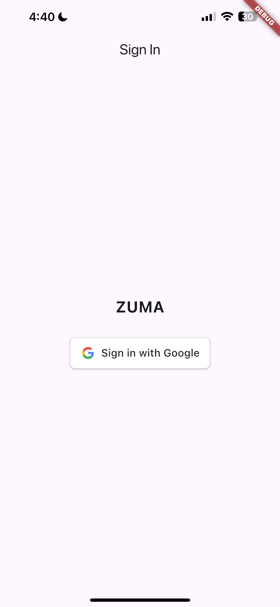
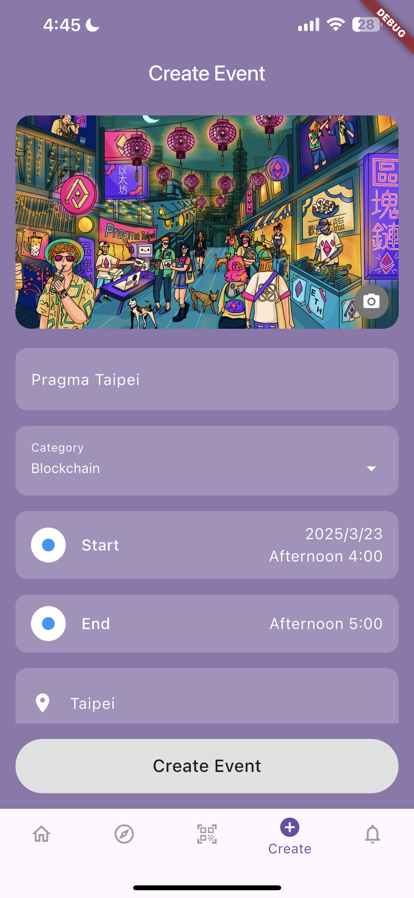
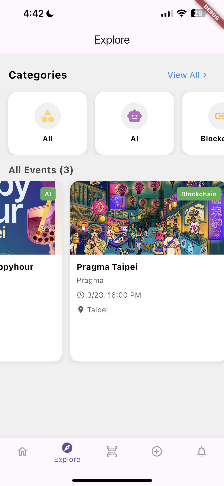
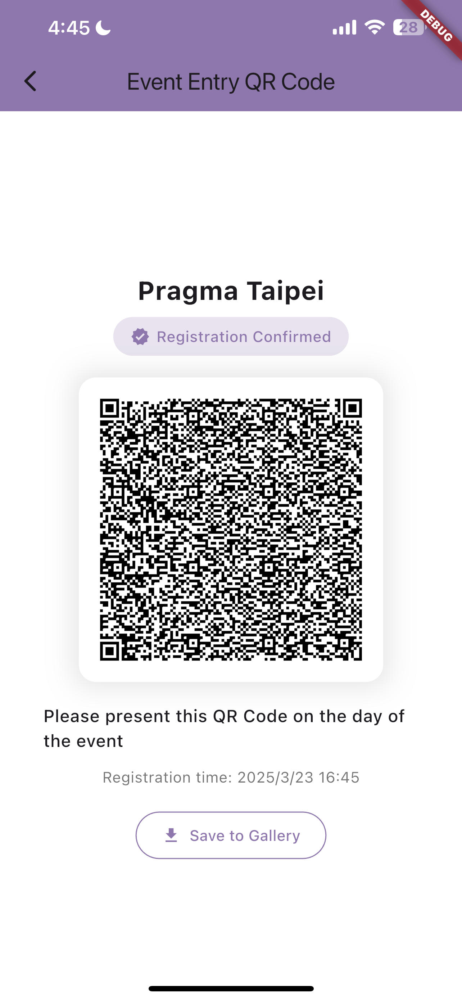
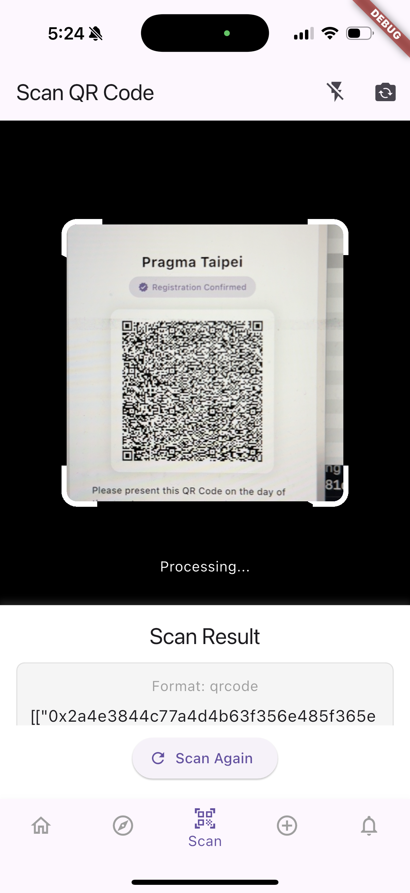
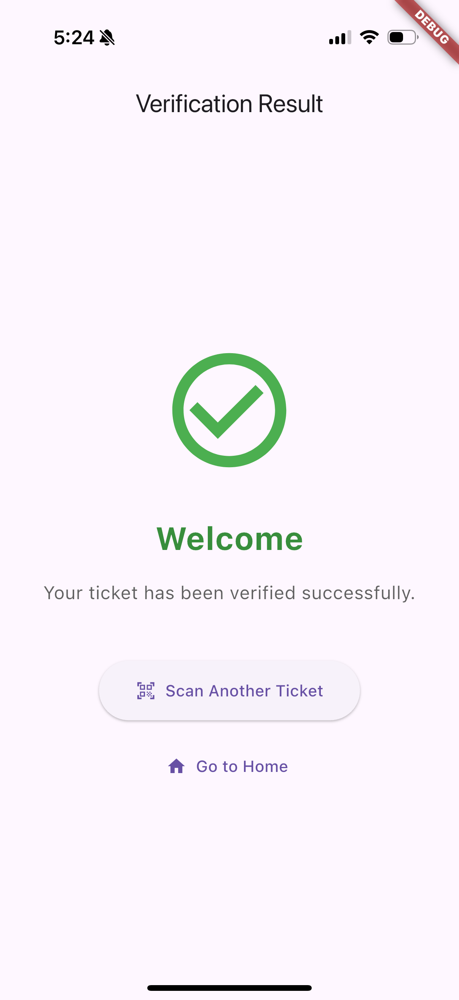

# Zuma

Zuma is a ZK-powered [Luma](https://lu.ma/) app.

This project is inspired by **Luma** and [**Zupass**](https://github.com/proofcarryingdata/zupass). We aim to combine the _seamless user experience of native apps_ like Luma with the _strong privacy guarantees_ of zero-knowledge proofs, as seen in Zupass. To achieve this, we developed Zuma.

Zuma works just like Luma, but with enhanced privacy. Users don’t need to share their email or name with the verifier. _Even better, anyone—not just the host—can verify the QR code presented by the user!_

## Technology

1. [Mopro](https://github.com/zkmopro/mopro): Mopro generates Rust bindings for iOS and Android, making ZK development seamless for mobile native apps.
2. [semaphore-rs](https://github.com/worldcoin/semaphore-rs): `semaphore-rs` integrates seamlessly with native platforms and outperforms the TypeScript implementation in terms of performance. Users can generate a membership proof for an event using a Semaphore proof, ensuring eligibility without revealing their identity, email, or any personal information—only a zero-knowledge proof.
3. [flutter](https://flutter.dev/): Flutter is a cross-platform framework for building native mobile apps, offering a rich ecosystem of libraries that simplify access to mobile hardware features like the camera, gallery, and more.

## Features

### Login with Google Account

Google account authentication allows us to verify that a user owns a given email address.

<p align="center">

</p>

### Create Event

Event hosts can effortlessly create an event on mobile, choose images from the gallery, or capture a photo on the spot.

<p align="center">

</p>

### Explorer

Users can browse their upcoming events and discover new ones.

<p align="center">


</p>

### Attend Event

Users can present a QR code to attend the event, and others can scan the code to verify the ZK proof.

<p align="center">



</p>

## How to Run

### Update mopro bindings

-   Refer to the getting started section in Mopro documentation: https://zkmopro.org/docs/getting-started/
-   Update function exporting to Rust bindings. Go to [`src/lib.rs`](src/lib.rs) and export functions with `#[uniffi::export]`. Check the [built-in types](https://mozilla.github.io/uniffi-rs/latest/types/builtin_types.html) that can be exported.
    - e.g.
      ```rs
      #[uniffi::export]
      fn semaphore_prove(
         id_secret: String,
         leaves: Vec<String>,
         signal: String,
         external_nullifier: String,
        ) -> ProofResult {
        ...
      }
      ```
-   Update the mopro bindings with the CLI
    ```sh
    mopro build
    ```
-   Update the mopro bindings in the flutter plugin
    -   iOS:
        -   Replace `mopro.swift` at `zuma/mopro_flutter_plugin/ios/Classes/mopro.swift` with the file generated during the Setup.
        -   Replace the directory `zuma/mopro_flutter_plugin/ios/MoproBindings.xcframework` with the one generated during the Setup.
    -   Android:
        -   Replace the directory `zuma/mopro_flutter_plugin/android/src/main/jniLibs` with the one generated during the Setup.
        -   Replace `mopro.kt` at `zuma/mopro_flutter_plugin/android/src/main/kotlin/uniffi/mopro/mopro.kt` with the file generated during the Setup.
    -   Update function interfaces in
        -   `zuma/mopro_flutter_plugin/lib`
        -   `zuma/mopro_flutter_plugin/ios/Classes/MoproFlutterPlugin.swift`
        -   `zuma/mopro_flutter_plugin/android/src/main/kotlin/com/example/mopro_flutter/MoproFlutterPlugin.kt`

### Run flutter app

-   Go to the App Directory

```sh
cd zuma
```

-   Check Flutter Environment

```sh
flutter doctor
```

-   Install Flutter Dependencies

```sh
flutter pub get
```

-   Running the App via Console

```sh
flutter run
```
